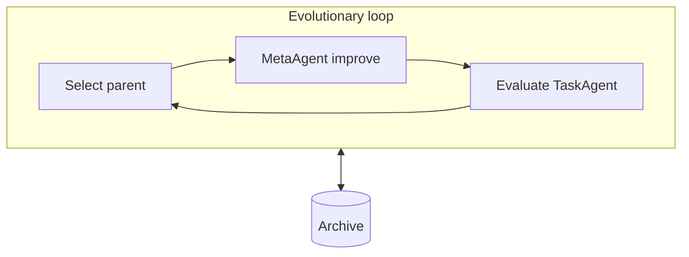
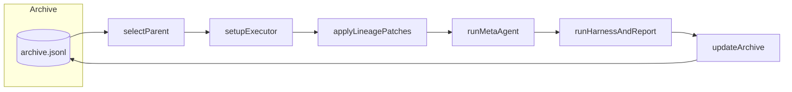
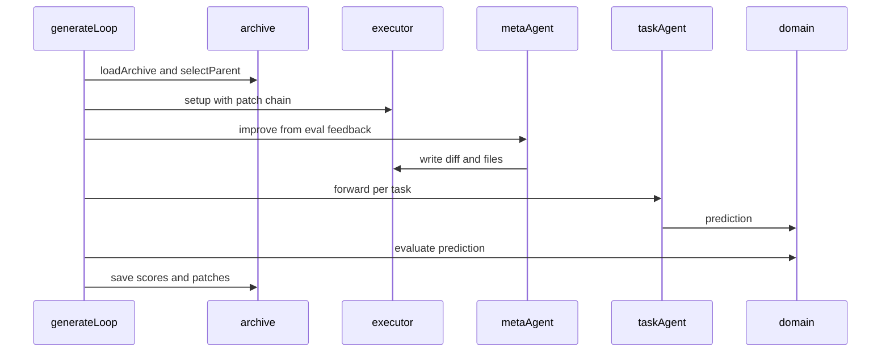
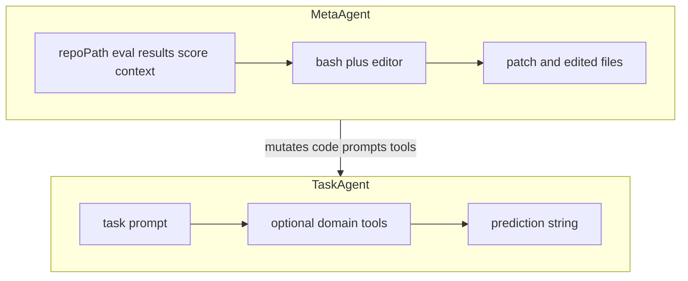
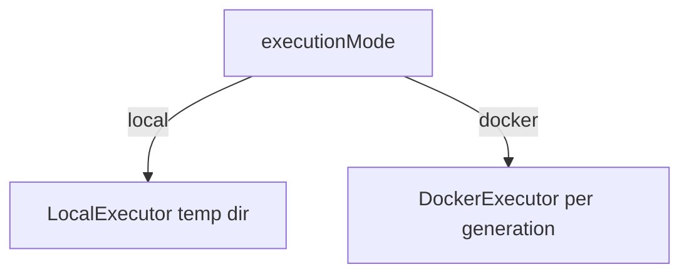
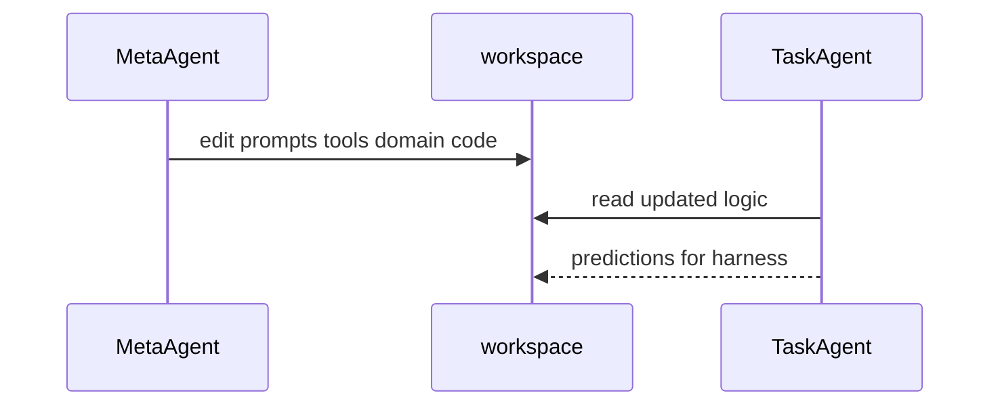
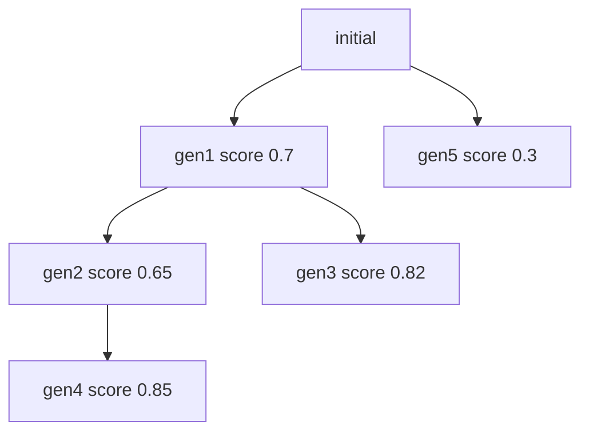
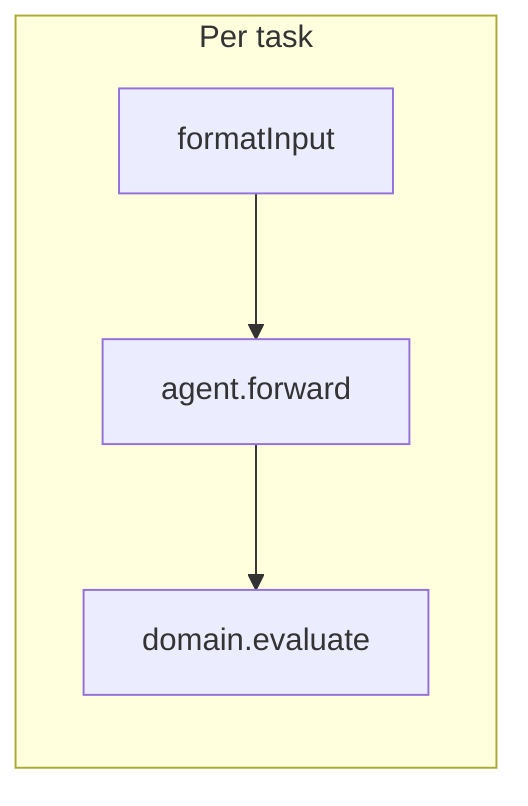
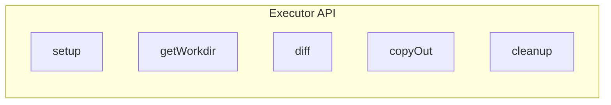
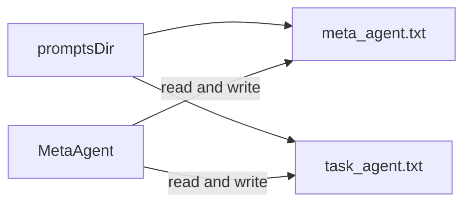

# Basic concepts

Deep dive into HyperAgents: agents, the evolutionary loop, archive, evaluation, and execution. **Workflow diagrams** are included below alongside the narrative so you can read in one place.

## Overview

HyperAgents combines **evolutionary computation** and **Quality-Diversity (QD)** ideas: keep an **archive** of agent versions, score each one, and use strong ancestors as parents for the next **mutation** (MetaAgent edits).



## Workflow diagrams

### Evolutionary loop (outer)



### One generation (sequence)

Use participant id **`Main`** (not `Loop`) — Mermaid reserves `loop` for control blocks.



### TaskAgent vs MetaAgent (programs)



### Execution mode



## The two agents

### TaskAgent — the worker

- **Input**: formatted task string (from `domain.formatInput`).
- **Output**: prediction string (and optional structured result).
- **Tools**: domain-specific, optional (e.g. calculator, bash).
- **Implementation**: `src/agent/task_agent.ts`.

Behavior is mostly **prompt + tools** — both can be edited by the MetaAgent.

### MetaAgent — the improver

- **Input**: repository path, evaluation paths, parent score context.
- **Output**: modified files / diffs on disk.
- **Tools**: framework **bash** + **editor** only.
- **Implementation**: `src/agent/meta_agent.ts`.

The MetaAgent is the **mutation operator**: it does not solve tasks directly; it rewrites what does.

### How they cooperate



## The evolutionary loop

Implemented in `src/core/generate_loop.ts`. Each generation typically:

1. **Select parent** from the archive (`select_parent.ts`).
2. **Set up executor** (local or Docker).
3. **Apply lineage** — replay patches so the workspace matches the parent.
4. **Run MetaAgent** — produce a new patch from failures and context.
5. **Run TaskAgent** via **harness** (staged eval may run first if configured).
6. **Evaluate** — domain scores predictions; reports written under output dir.
7. **Update archive** — append JSONL snapshot with new `genId`, scores, patch list.

### Configuration sketch

```typescript
const config: GenerateLoopConfig = {
  domains: [myDomain],
  metaAgent,
  taskAgentFactory: (t) => new TaskAgent({ model, tools: t }),
  tools: getFrameworkTools(),
  outputDir: "./outputs/evolution",
  repoPath: ".",
  maxGenerations: 5,
  executionMode: "local",
  parentSelection: "score_child_prop",
  evalSamples: 10,
};
```

## The archive

The archive is an append-only **JSONL** file: each line is a full snapshot `{ archive, entries }`. Read the **last line** for current state.

### Entry shape (conceptual)

| Field | Meaning |
| --- | --- |
| `genId` | Unique generation id |
| `parentId` | Parent generation (tree edge) |
| `patchFiles` | Patch paths in lineage |
| `scores` | Per-domain numeric scores |
| `validParent` | Can future gens use this as parent? |
| `metadata` | Run metadata (e.g. `run_eval`) |

### Lineage is a tree

Branches are normal: `parentId` points to the actual ancestor, not necessarily the latest id.



### Why JSONL?

Appending a line is cheap; you keep **history** of every snapshot without rewriting a giant JSON file. See also **JSONL vs JSON** in the table below.

| | JSON | JSONL |
| --- | --- | --- |
| Structure | One object per file | One object per line |
| Append | Rewrite file | Append line |
| Latest state | Parse all | Read last line |
| Typical use here | `report.json`, `predictions.json` | `archive.jsonl` |

## Parent selection strategies

From `src/core/select_parent.ts`, chosen **once** in config for the whole run:

| Strategy | Behavior |
| --- | --- |
| `random` | Uniform over valid parents — max exploration |
| `latest` | Most recent valid parent — simple chain |
| `best` | Highest score — pure exploitation |
| `score_prop` | Random weighted by score |
| `score_child_prop` | Score-weighted with **child penalty** (default) — explore under-used parents |

**Why not always `best`?** You can get stuck in a **local maximum**; sometimes a weaker parent opens a path to a better global solution.

Child penalty (default strategy) uses: **`weight = (score + 0.01) × 1 / (1 + numChildren)`**.

## Domains and evaluation

A **Domain** (`src/domains/base.ts`) defines your benchmark:

- `config` — name, splits, score keys, sample counts.
- `loadTasks` — async load of `DomainTask[]`.
- `evaluate` — score one prediction (usually 0–1).
- `formatInput` — task → model prompt.
- `report` — aggregate `EvalResult[]` into summary.

Example domains in the repo include bash, scoring, calculator, factcheck, paper review, and git evolution demos.

## Evaluators

`src/domains/evaluators.ts` provides three patterns:

1. **`staticEvaluator`** — normalized string equality; free and deterministic.
2. **`llmJudgeEvaluator`** — rubric-based model scoring; costs tokens.
3. **`humanFeedbackEvaluator`** — map user ratings to the **0–1** interval.

Pick the one that matches task objectivity and budget.

## The harness

`src/domains/harness.ts` connects TaskAgent to tasks:



Used for one-off evals and inside `runGenerateLoop`.

## Predictions vs scores

| | Score | Prediction |
| --- | --- | --- |
| What | Number from 0 to 1 | Model output string |
| Typical files | `report.json` | `predictions.json` |
| Used for | Parent selection, ranking | User-facing output, debugging |

**`ensemble`** (`src/core/ensemble.ts`) picks a high-scoring generation and returns its prediction for a given question.

## Executors

`src/utils/executor.ts` — same interface, two modes:

- **Local** — temp directory, fastest for development; host must trust generated code.
- **Docker** — per-generation container; slower, safer for untrusted codegen.



## Output layout (evolution)

Typical tree under `outputDir`:

```text
outputs/bash_evolution/
├── archive.jsonl
├── gen_initial/metadata.json
├── gen_1/
│   ├── metadata.json
│   ├── agent_output/model_patch.diff
│   └── bash_eval/
│       ├── predictions.json
│       └── report.json
└── gen_2/ ...
```

Single eval (no loop) may only have `predictions.json` and `report.json`.

## Self-referential improvement (prompt files)

If HyperAgents is installed from npm, framework TypeScript in `node_modules` is not what you mutate. Instead, point agents at **files in your repo**:

```typescript
const metaAgent = new MetaAgent({ model, promptFile: "./prompts/meta_agent.txt" });
// or
const config: GenerateLoopConfig = {
  // ...
  promptsDir: "./prompts",
};
```

With `promptsDir`, the loop can scaffold `meta_agent.txt` and `task_agent.txt`. Template placeholders such as `{{repoPath}}`, `{{evalPath}}`, `{{scoreContext}}` are filled at runtime (see main repo `docs/concepts.md`).



Without `promptsDir`, built-in templates are used — the MetaAgent still edits **your** domain code and separate files, but not its packaged default prompt text.

## Early termination

- If **best archive score** reaches **1.0**, the loop stops (no wasted compute).
- MetaAgent prompt includes score context so it avoids needless edits when already at 100%.

## Examples overview

| Example | Demonstrates | Loop |
| --- | --- | --- |
| scoring | Prompt / grading logic | Manual or demo script |
| calculator | Fixing a buggy tool | Manual iterations |
| bash | Command generation | `eval` / `evolve` |
| factcheck | Classification | `eval` / `evolve` |
| paper_review | Accept/reject | Single eval in script |
| git_evolution | Git-native patches | Full loop |

## Glossary

| Term | Definition |
| --- | --- |
| Archive | JSONL history of generations and scores |
| Domain | Task suite + evaluation for one benchmark |
| Evaluator | static / LLM judge / human scoring helper |
| Executor | Local or Docker workspace for one generation |
| Generation | One improve + evaluate cycle |
| Harness | Runs TaskAgent over domain tasks |
| MetaAgent | Edits code to improve TaskAgent |
| Parent | Archive node used as base for a child |
| Patch | Diff capturing MetaAgent changes |
| Prediction | Raw TaskAgent output for a task |
| Selection strategy | Rule for picking the next parent |

## See also

- [Architecture](./architecture.md)
- [Limitations](./limitations.md)
