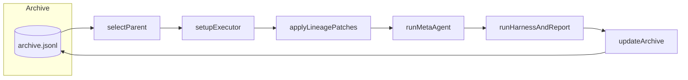
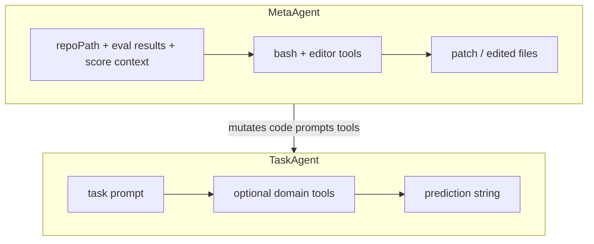
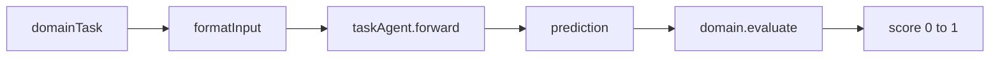
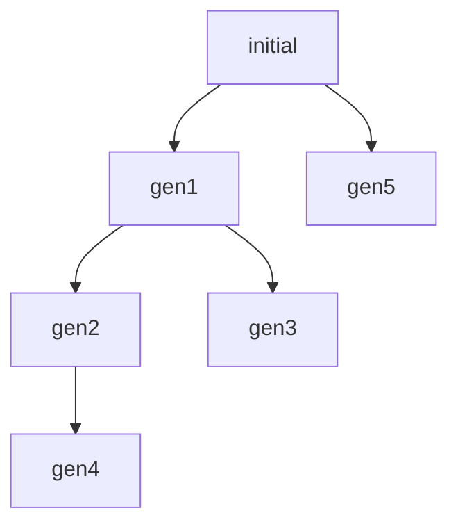
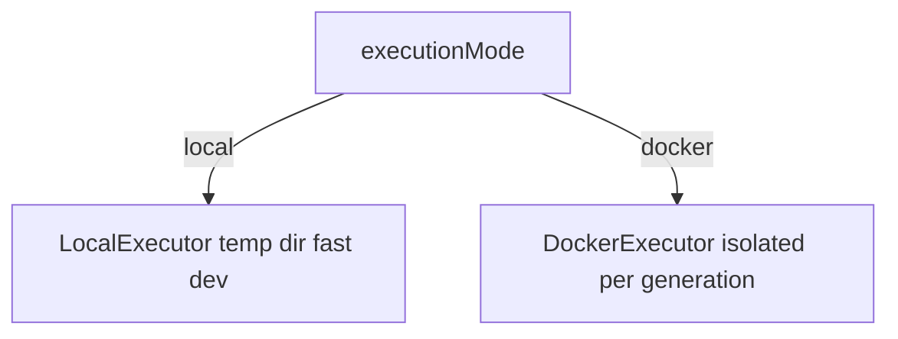
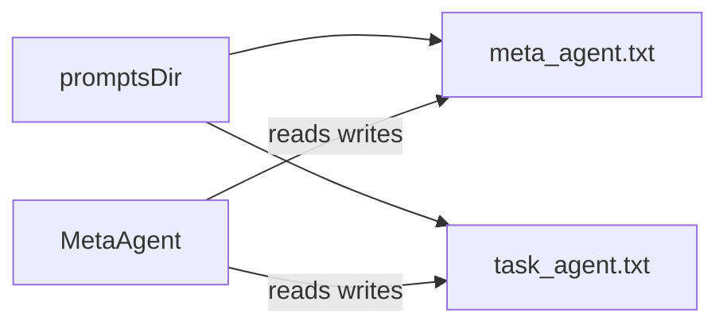

# Workflows (diagrams)

High-signal **Mermaid** views of the system. For narrative detail, see [Concepts](./concepts.md).

## Evolutionary loop (outer loop)



Each generation: pick a **parent**, materialize its code in a workspace, let **MetaAgent** mutate it, **evaluate** with the harness, then **append** a new snapshot to the archive.

## One generation (sequence)

```mermaid
sequenceDiagram
  participant Loop as generateLoop
  participant Arch as archive
  participant Exec as executor
  participant Meta as metaAgent
  participant Task as taskAgent
  participant Dom as domain
  Loop->>Arch: loadArchive / selectParent
  Loop->>Exec: setup(patchChain)
  Loop->>Meta: improve repo from eval feedback
  Meta->>Exec: write diff / files
  Loop->>Task: forward per task
  Task->>Dom: prediction
  Loop->>Dom: evaluate(prediction)
  Loop->>Arch: save generation scores patches
```

## TaskAgent vs MetaAgent



## Harness (per task)



## Archive lineage (example)

Different children can have different parents — the history is a **tree**, not only a line.



## Executor choice



## Self-referential prompts (optional)

When `promptsDir` is set, prompt text files live in the user repo and can be edited by the MetaAgent across generations — including **its own** instructions.



## Where to go next

- [Concepts](./concepts.md) — strategies, evaluators, JSONL, early termination.
- [Limitations](./limitations.md) — frozen LLM, costs, outer-loop design.
